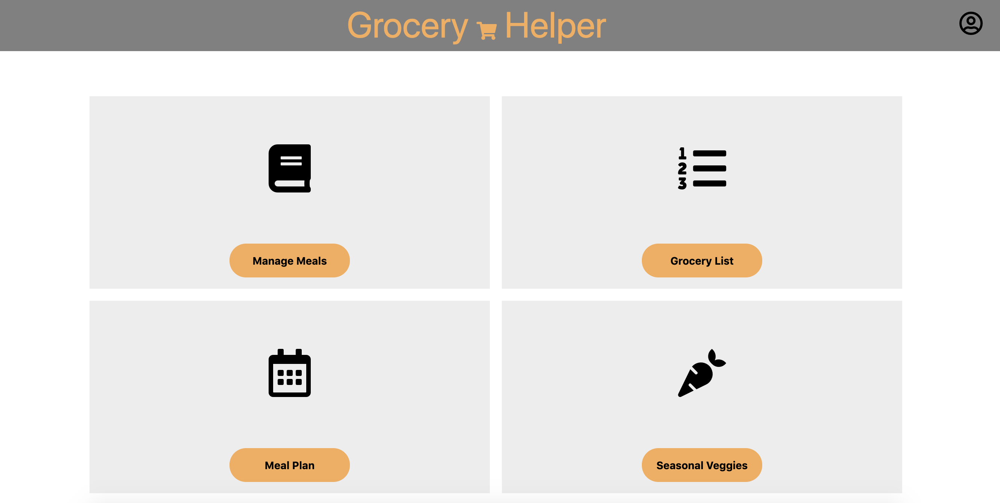
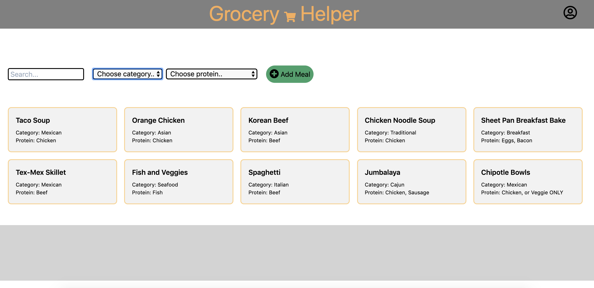
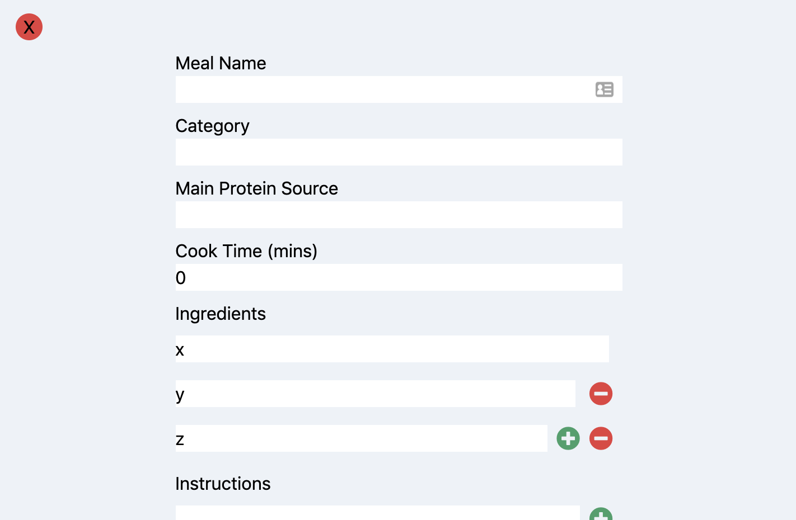
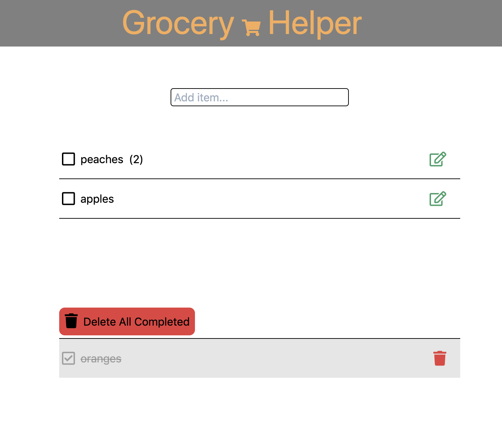
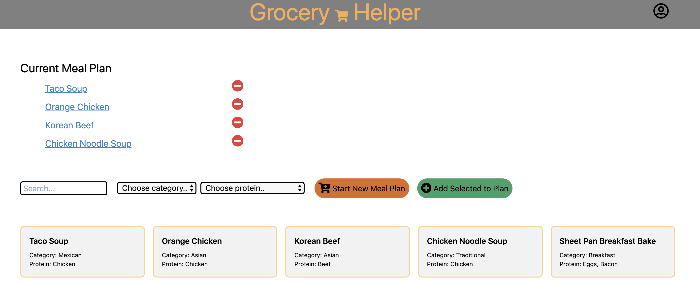

# Grocery Helper

A proof of concept for a meal/recipe management system and grocery planning aid. This is another iteration on this concept. I have built previous iterations based on a similar concept. 

## Pictures

 

 

 

 

## Features

**Manage Meals** - Store meal information, including recipes. Search and filter to find specific meals in your collection.

**Grocery List** - Keep track of what you need to buy at the grocery store this week, including the quantity of each item.

**Meal Plan** - Add and remove meals from you Meal Plan. Keep track of what you're having for dinner for the week, and when it's time to make dinner, click on the meal in your plan to view the recipe.

&nbsp;&nbsp; \*Click a button to automatically populate the grocery list with the ingredients for each meal on the current meal plan.
